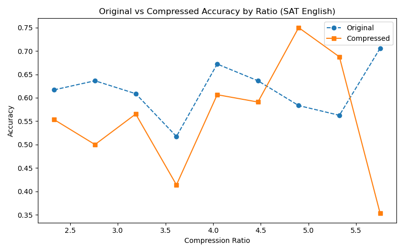
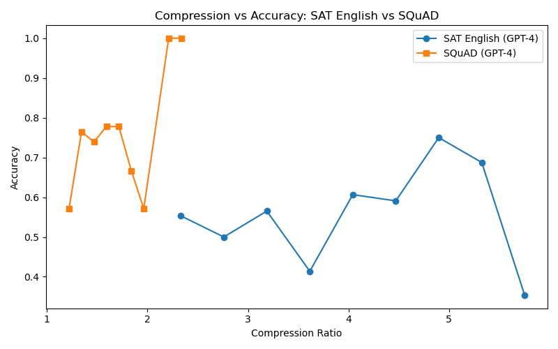
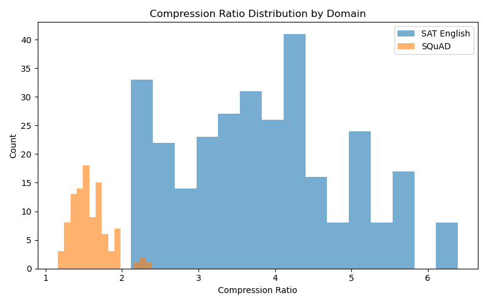
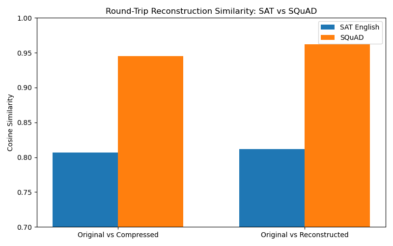

# LLMLingua-2: Domain Specific Compression, Soft Scoring Alignment, and Round-Trip Evaluation
This is based off of the paper: LLMLingua-2: Learn Compression Target via Data Distillation for Efficient and Faithful Task-Agnostic Prompt Compression

---
# Background
## What is LLMLingua-2?
LLMLingua-2 uses GPT-4 to create training pairs of original text and compressed text by prompting it to remove unnecessary tokens.
It then trains a small BERT-style encoder on this dataset. 

## What was wrong with LLMLingua-1?
It used information entropy from a causal LM (LLaMA) to measure uncertainty to score tokens and prune with respect to those scores. BERT looks at all tokens simultaneously while GPT looks unidirectionally, potentially missing out on context from future tokens.
---

# Prompt used in the paper:
COMPRESSION_PROMPT = """You are an excellent linguist. Compress the given 
text to short expressions, such that you can reconstruct it as close as 
possible to the original. Unlike usual text compression:
1. Compress by removing words only — never add new words
2. Compress as aggressively as possible  
3. Retain as much information as possible
4. Keep all named entities, numbers, dates
5. Output ONLY the compressed text, nothing else

Text to compress:
{text}"""

# Sample 1 (Vanilla):
Original (100 tokens):
```The effects of climate change on our water resources can have a big impact on our world and our lives. Patterns of where, when, and how much precipitation falls are changing as temperatures rise. Some areas are experiencing heavier rain events while others are having more droughts. Flooding is an increasing issue as our climate is changing. Compared to the beginning of the 20th century,  precipitation events are stronger, heavier, and more frequent across most of the United States. Drought is also becoming```

Compressed (63 tokens):
```Climate change effects on water resources impact world and lives. Precipitation patterns changing with rising temperatures. Some areas experiencing heavier rain, others more droughts. Flooding increasing with climate change. Compared to 20th century start, precipitation events stronger, heavier, more frequent across most United States. Drought increasing.```

Compression ratio = 1.6x

---

# Contributions
# 1. SAT English downstream task evaluation

I used an SAT Egnlish dataset to evaluate compression quality becuase QA pairs provide quantitative feedback as aposed to qualitative methods like RLAIF. Also, SAT English is semantically dense and contains a mix of informational text and literature/prose. 

| Condition | Accuracy |
|-----------|----------|
| No Compression | 63.09% |
| GPT-4 Compression (4.5x ratio) | 54.36% |


**Only a 9% accuracy drop at an average 4.5x compression ratio** 
GPT-4 very aggressively compressed SAT English despite the passages being semantically dense. 


*llama3.2 seems to be arbitrarily equally as good at answering original and compressed SAT English questions.*
There seems to be no strong relationship between performance of compressed vs. uncompressed, but sometimes, **compressed passages outperform uncompressed passages.** 
This strongly suggests that compression is not necessarily harmful.

---

# 2. GPT-4 vs. BERT Compression Accuracy
I evaluated the performance of llama3.2 on both the original and compressed SAT passages from GPT-4 and BERT. 

| Method | Compression Ratio | SAT Accuracy |
|--------|-------------------|--------------|
| No Compression | 1x | 60.07% |
| GPT-4 Compression | ~4.5x | 53.36% |
| BERT Compression | — | 54.04 |

BERT matches GPT-4 accuracy at similar compression ratios. For SAT English datasets, a small encoder can replace an expensive large model for compression during inference.

# 3. Domain-specific compression (!)
| Domain | Dataset | Avg. Compression Ratio | Avg. Cosine Score (Compressed) | Avg. Cosine Score (Reconstructed) | Notes |
|--------|---------|------------------------|---------|---------------------|-------|
| Literary + Fiction| SAT English | ~4.5x | 0.8069 | 0.8114 |High ratio; stylistic content aggressively pruned |
| Factual / Encyclopedic | SQuAD (Wikipedia) | ~1.5x | 0.9450 | 0.9624 |Lower ratio; dense factual content preserved |



The compression ratio for SQuAD clusters at 1-2x while SAT goes from 2-6x. 

> **KEY FINDING:** With the same compression prompt, GPT-4 compresses rhetorical text (SAT) much more aggressively than encyclopedic text. Therefore, **the compression ratio must be a function of the domain and type of text.**

SQuAD, a factual text (1.5x compression) retains significantly more semantic similarity than SAT (4.5x compression). Reconstruction recovers some lost meaning, but the gap is larger for SQuAD (0.017 gain) vs SAT (0.005 gain). **Therefore GPT-4 recovers more meaning from factual compressed text than rhetorical/literary compressed text**

# 4. Round Trip Reconstruction + Cosine Similarity Metric
After compressing the text, have GPT-4 reconstruct the original using the compressed text. Score the similarity using Cosine Similarity scoring.

- **Original vs. Compressed:** 0.902
- **Original vs. Reconstructed:** 0.936

As compression becomes more aggressive, semantic similarity decreases.


**GPT-4 reconstructed prompt is more semantically similar to the original than the compressed prompt is to the original. Therefore, GPT-4 successfully recovers meaning lost during compression.** 


GPT-4 was able to reconstruct SQuAD with much higher accuracy than SAT.

# 5. Alignment + Soft Scoring 
**Why does Soft Scoring not work:**
### 1. Soft Scoring with GPT-4:
Prompt GPT-4 to score each word from 0.0-1.0, providing more nuance for pruning.
Problem: GPT-4 hallucinates due to lack of reasoning. This hallucination compounded over time and soon all scores were converging to 0.
```[0.9, 0.9, 0.9, 0.9, 0.1, 0.5, 0.1, 0.5, 0.1, 1.0, 1.0, 1.0, 1.0, 0.5, 0.5, 0.1, 1.0, 1.0, 0.1, 0.5, 0.1, 0.1, 0.5, 0.5, 0.5, 0.1, 0.1, 0.1, 0.5, 0.1, 0.1, 0.5, 0.1, 0.5, 0.5, 0.1, 0.5, 1.0, 0.5, 0.1, 0.5, 0.5, 1.0, 0.1, 0.5, 0.1, 0.1, 0.5, 0.5, 0.1, 0.1, 0.5, 0.5, 0.5, 0.1, 0.1, 0.1, 0.5, 0.1, 0.1, 0.1, 0.1, 0.1, 0.1, 0.1, 0.1, 0.1, 0.1, 0.1, 0.1, 0.1, 0.1, 0.1, 0.1, 0.1, 0.1, 0.1, 0.1, 0.1, 0.1]```

### 2. Binary scoring (from original paper):
Not working because GPT-4 paraphrased the passages in the dataset instead of just dropping tokens.
- Poetic writing: GPT paraphrases very aggressively to replace flowery language with semantically important words (and reorders alot)
- Informational writing: Expected GPT to paraphrase less, but it still discards almost the entire middle section. 

Note about SAT English compression: The average compression ratio is 4.5, very aggressive likely because the compression prompt was to “compress as aggressively as possible.” While this affects alignment heavily, it surprisingly didn’t really affect performance– the answers for the aggressively compressed prompts were still quite accurate, with only a 9% loss. This is interesting because SAT English is supposed to be semantically very dense. Often, questions will ask about the context in which a certain word is used. However, if that word is pruned, the answer will likely be incorrect.

### 3. Soft Scoring with Attention Weights:
For this sentence: “The Great Depression was a Severe Global Economic Crisis.” The scores are as follows:
[CLS]: 0.150
the: 0.038
great: 0.025
depression: 0.057
was: 0.053
a: 0.034
severe: 0.027
global: 0.034
economic: 0.032
crisis: 0.045
.: 0.130
[SEP]: 0.377
The problem is attention weights do not correspond to importance. 

---

# Next Steps:

## BERT Potential Overfitting
- I noticed validation loss stopped improving after Epoch 2, while training loss improved. 

| Epoch | Training Loss | Validation Loss |
|-------|---------------|-----------------|
| 1     | 0.3652        | 0.3559          |
| 2     | 0.3498        | 0.3508          |
| 3     | 0.3384        | 0.3510          |


## Soft Scoring 
- Use Large Reasoning Model or prompt GPT-4 to reason before assigning a score to each token, which may prevent its descent into madness

## More Domains:
- Technical domains like medical or legal documents. High utility because they often use RAG. 

- News articles. Interesting to see how compression will affect the journalistic voice and if it maintains the bias. 

- More literature/poetry. If compressed and reconstructed, will a model be able to predict the writer?


SQUAD:
Done. Avg cosine (orig vs compressed): 0.9450
Done. Avg cosine (orig vs reconstructed): 0.9624